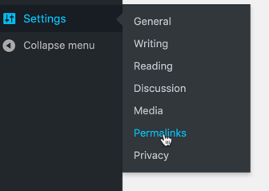

# WordPress Installation Guide for CiviCRM

## Scope of this guide and alternative installation methods

This guide covers standard installation of CiviCRM for production use. For installing a development environment, refer to the [section on Buildkit in the Developer Documentation](https://docs.civicrm.org/dev/en/latest/tools/buildkit/).

## Before installing

1. Ensure that your system meets the [requirements](/requirements.md).
1. Install WordPress by referring to the [WordPress Installation Guide](http://codex.wordpress.org/Installing_WordPress) if needed.

!!! note "Path for WordPress"
     The rest of these instructions assume that you have WordPress installed in `/var/www/wordpress`. Adjust paths as needed.

## Download and Un-zip CiviCRM Code

All CiviCRM code and packages used by CiviCRM (such as PEAR libraries) are included in the compressed CiviCRM distribution files ('zips'). Follow these steps to download and install the codebase:

* Download the appropriate zips file from [here](https://civicrm.org/download) with your browser. The zip file-names include the CiviCRM version. For example, **civicrm-x.x.x-wordpress.zip.**

* Copy or ftp the zip file to your WordPress installation's `/wp-content/plugins` directory. You may have to change the "File Permissions" setting of `/wp-content/plugins/civicrm` directory to allow for "Write" Access. Just remember to change it back to default when done.
* You can upload the zip file that was downloaded via your WordPress admin panel at `wp-admin/plugin-install.php`

* Create the `<wordpress path>/wp-content/plugins/files/` directory and ensure it is writable. CiviCRM for versions 4.6 and prior uses this directory for temporary and uploaded files.

    !!! information "Downloading Directly to Your Server with wget"
    
        If you have command-line access, you may prefer to download the zip file directly to your server using wget:
        
        1. Move into WordPress's plugin directory
            ```
            $ cd /var/www/wordpress/wp-content/plugins
            ```
        
        1. wget the file (modify this line to use the current zip file name for the version you want)
            ```
            wget https://download.civicrm.org/civicrm-x.x.x-wordpress.zip
            ```


* Extract (aka: unzip, unpack) the codebase into the wordpress/wp-content/plugins directory.

    1. Move to the wordpress/wp-content/plugins directory (if not already there)
        ```
        $ cd /var/www/wordpress/wp-content/plugins
        ```
    
    1. Un-zip the file (modify this line with the actual downloaded filename)
        ```
        unzip civicrm_download_file.zip
        ```

* You should now have a `/var/www/wordpress/wp-content/plugins/civicrm` directory containing `civicrm.php`, `README.txt` and another civicrm directory (which in turn contains bin, CRM, sql, templates, etc.).

## If Using Localization, Download and Un-tar the Localization Files

Follow these steps to download and install the files that contain strings for languages other than American English:

* Download the appropriate tarball file from [civicrm.org/download](https://civicrm.org/download) within your browser. Tarball file-names include the CiviCRM version, and `l10n`. For example, `civicrm-4.5.x-l10n.tar.gz`.

* Copy or ftp the tarball file to your WordPress installation's `/wp-content/plugins` directory. You may have to change the "File Permissions" setting of `/wp-content/plugins` directory to allow for "Write" Access. Just remember to change it back to default when done.

    !!! note "Downloading Directly to Your Server with wget"
    
        If you have command-line access, you may prefer to download the tarball file directly to your server using wget:
        
        1. Move into WordPress's modules directory and then into the civicrm subdirectory
            ```
            $ cd /var/www/wordpress/wp-content/plugins/civicrm
            ```
        
        1. wget the file (modify this line to use the current tarball file name for the version you want)
            ```
            $ wget https://download.civicrm.org/civicrm-x.x.xx-l10n.tar.gz
            ```


* Un-tar (unpack) the language files into the wordpress/wp-content/plugins/civicrm directory.

    1. Move to the wordpress/wp-content/plugins/civicrm directory (if not already there)
        ```
        $ cd /var/www/wordpress/wp-content/plugins/civicrm
        ```
    
    1. Un-tar the file (modify this line with the actual downloaded filename)
        ```
        $ tar -zxvf civicrm_download_file.tgz
        ```

* You should now have a `wordpress/wp-content/plugins/civicrm/civicrm/l10n` directory with a number of directories below it (including bin, CRM, sql and templates).

## Enable CiviCRM plugin and run installer

The installer will verify that you've downloaded the correct version of CiviCRM, and will check your server environment to make sure it meets CiviCRM requirements. It will then create and populate a database for CiviCRM as well as create your CiviCRM settings file `civicrm.settings.php`.

* Login to your WordPress site with Administrator level permissions.

* Go to plugins page: `http://example.org/wp-admin/plugins.php`.

* Click the **Activate** link to activate the CiviCRM plugin.

* Then go to Settings > CiviCRM Installer: `http://example.org/wp-admin/options-general.php?page=civicrm-install`
    
* In version 4.7 and above you will see a link on the wp-admin page to the Installer screen
    
* You should see the **CiviCRM Installer** screen.

    * If you see any errors, check the **Requirements** details at the bottom of the page for more information. You will need to correct any issues before continuing.
    
* CiviCRM Database Settings.

    * Initially, the installer will default to using the existing WP database for the CiviCRM data.  You can change this if you want

    !!! tip "Where Should I Store CiviCRM Data?"
        CiviCRM may be configured to use your existing WordPress database, or a separate (new) database. Using a separate database is generally preferred - as it makes backups and upgrades easier. The installer will create a new database for CiviCRM automatically if you enter a database name that doesn't already exist on your database server AND the database user you enter has permission to create databases. In case the installer does not automatically create a new database, simply create a new one following the same process as creating a new database for WordPress.

* Fill in the WordPress Database Settings for your existing WordPress database. CiviCRM will fill in the WP database settings, you can change these if you want to use a separate database.

    !!! tip "Loading Sample Data"
        The Installer includes an option to load a set of sample contact, group, and relationship data by default. Sample data can provide a useful head-start in learning to use CiviCRM. However, if you do NOT want the sample data to be loaded, just uncheck **Load sample data** under **Other Settings**.

* Select the appropriate language for the base installation. You will be able to add other languages after the installation for multi-lingual sites.

* Click the **Check Requirements and Install CiviCRM** button.

    * The installer will configure your databases, create the settings file and will redirect to success message.
    * If you still see a red bar with the message "These database details don't appear to be correct." - check the Database Details section below your settings for specific errors and problems. Once you correct these problems, click "Recheck requirements" to verify your settings before continuing.
    * If you are on a Windows machine and get the message "The user account used by your web-server needs to be granted write access to the following directory in order to configure the CiviCRM settings file:
 C:<wordpress path>/wp-content/plugins/civicrm/" even after changing directory permission in Explorer, see [http://forum.civicrm.org/index.php/topic,5056.msg23720.html#msg23720](http://forum.civicrm.org/index.php/topic,5056.msg23720.html#msg23720) for instructions how to change the permissions using CMD.
    * Once you see the green "You're ready to install!" message - you can click **Check Requirements and Install CiviCRM**

## Locate and Backup the CiviCRM settings file

After installation, a configuration file will have been created by CiviCRM at: `<wordpress>/wp-content/uploads/civicrm/civicrm.settings.php`

It is critical you make a copy of this file and save as a backup in a safe location. This file contains passwords and other critical information, take precautions to secure the copy from prying eyes.

Should an upgrade fail, you will need this backup copy to restore your site.

## Enabling Cleaner URLs for WordPress

* Starting in Version 5.13.x CiviCRM now can support "Clean URLs" for WordPress
* By default CiviCRM URLs are in the format of https://example.org/civicrm?page=CiviCRM&q=civicrm/contribute/transact&reset=1&id=1 for a Contribution Page.  Enabling Cleaner URLs will enable URLs in the format of
  * A Contribution Page will have the format of https://example.org/civicrm/contribute/transact/?reset=1&id=1  
  * Profile Pages can be accessed at https://example.org/civicrm/profile/edit/?gid=1&reset=1 or https://wpcvrc.tadpole.cc/civicrm/profile/create/?gid=1&reset=1 
  * Listings would be at https://example.org/civicrm/profile/?gid=1&reset=1
  * The User's Contact Dashboard can be accessed at https://example.org/civicrm/user/?reset=1
* To Enable Cleaner URLs , start by backing up your `Civicrm.settings.php` file as detailed in the "Locate and Backup the CiviCRM settings file" section above.
* Then find this section of code in `civicrm.settings.php` On a default install it should be around line 480

```php
if (!defined('CIVICRM_CLEANURL')) {
  if ( function_exists('variable_get') && variable_get('clean_url', '0') != '0') {
    define('CIVICRM_CLEANURL', 1 );
  }
  elseif ( function_exists('config_get') && config_get('system.core', 'clean_url') != 0) {
    define('CIVICRM_CLEANURL', 1 );
  }
  else {
    define('CIVICRM_CLEANURL', 0);
  }
}
```


* Replace the above code with:

```php
if (!defined('CIVICRM_CLEANURL')) {
  // check for Drupal clean URLs
  if ( function_exists('variable_get') && variable_get('clean_url', '0') != '0') {
    define('CIVICRM_CLEANURL', 1 );
  }
  elseif ( function_exists('config_get') && config_get('system.core', 'clean_url') != 0) {
    define('CIVICRM_CLEANURL', 1 );
  }
  // check for WordPress clean URLs
  elseif( function_exists('get_option') && get_option('permalink_structure') != '' ) {
    define('CIVICRM_CLEANURL', 1 );
  }
  else {
    define('CIVICRM_CLEANURL', 0 );
  }
}
```

* You will need  to flush rewrite rules in WordPress for clean URLs to work. Visit the Permalinks settings page to trigger this Go to Settings —> permalinks The URL will be  https://example.org/wp-admin/options-permalink.php

  . 

* Now Cleaner URLs will be enabled.  Enabling Cleaner URLs does not change how Shortcodes work in CiviCRM and existing "Old" style URLs will still work

## Create CiviCRM Contacts for Existing WordPress Users

Once installed, CiviCRM keeps your WordPress Users synchronized with corresponding CiviCRM contact records. The 'rule' is that there will be a matched contact record for each WordPress user record. Conversely, only contacts who are authenticated users of your site will have corresponding WordPress user records.

When CiviCRM is installed on top of an existing WordPress site, a special CiviCRM Administrative feature allows you to automatically create CiviCRM contacts for all existing WordPress users:

* Login to your WordPress site with an administrator-level login
* Click the **CiviCRM** link in the main navigation block
* (If your WordPress site makes use of the `db_prefix` setting (in `settings.php`), in de top bar click **Administer » System Settings » CMS Database Integration** , and update the box for the WordPress Users Table Name so that it includes the prefix.)
* Click **Administer** in the menu bar
* Click **Users and Permissions** from the drop-down menu, then select **Synchronize Users to Contacts**

## Review the Configuration Checklist

The **Configuration Checklist** provides a convenient way to work through the settings that need to be reviewed and configured for a new site. You can link to this checklist from the installation success page AND you can visit it at any time from **Administer** » **Administration Console** » **Configuration Checklist**.

## Test-drive CiviCRM

There should now be a **CiviCRM** link in your WordPress menu. Click that link and the CiviCRM Menu, Shortcuts, Search and New Individual Blocks should appear. You can now explore CiviCRM end-user features and begin configuring CiviCRM for your site/organization needs.

## Trouble-shooting Resources {:#troubleshooting}

* Review the [Troubleshooting](/troubleshooting.md) page for help with problems you may encounter during the installation.
